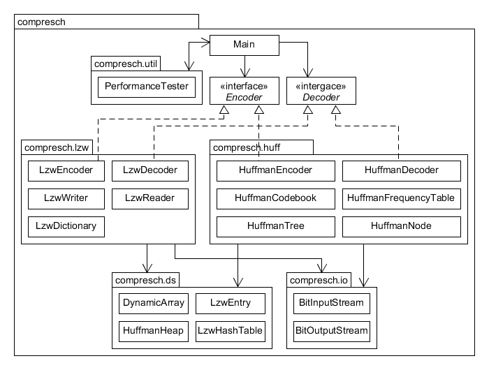
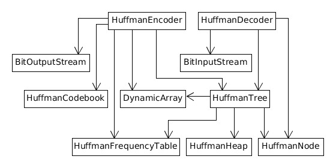
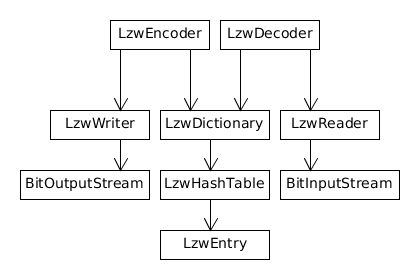

# Implementation
## Overview and Big-O analysis
### Huffman coding
Huffman coding takes a single bytes from input stream, translates them to variable length bit sequences and writes them to output stream. Intent is that encoded bit sequence is shorter in length than original input stream. Huffman coding tries to achieve this by using an optimal prefix coding for given input stream.

Huffman coding has been implemented in a canonical fashion to minimize the length of code table in output stream. In canonical Huffman coding lengths of encoded bytes are stored in code table in stead of actual codes corresponding to original byte values. The size of code table in encoded file is always 256 bytes.

Dynamic array(w/ Generics) and specialized minimum heap for prefix tree nodes are utilized in this implementation.

#### Algorithm for encoding
1. Collect occurrences of distinct bytes in input stream by traversing it
2. Build a prefix code tree from byte frequencies collected in step 1.
3. Traverse prefix tree to get code lengths for distinct bytes
4. Build canonical prefix tree from code lengths collected in step 3.
5. Traverse canonical prefix tree to get dictionary of codes.
6. Write code lengths collected in step 3 to output (in ascending order of byte value).
7. Read input stream one byte at a time. Translate each byte to variable length bit sequence with dictionary built in step 5 and write it to output.

#### Analysis of encoding
In all steps *n* denotes length of input stream in bytes and *k* denotes count of distinct bytes found in input stream.
1. *Time: O(n), space: O(1).* The whole input stream is traversed and size of array containing occurrences is constant.
2. *Time: O(k log k), space: O(k).* Prefix tree is built by first inserting each node into minimum heap, then extracting two minimum nodes, combining them to a single node and pushing it back to heap. Size of heap and built tree are O(k).
3. *Time: O(k), space: O(log k).* Prefix tree is traversed inorder by using recursion. Size of array containing code lengths is constant.
4. *Time: O(k), space: O(k).* Array of code lengths is of constant size, but in absolutely worst scenario it might be traversed *k/2* times. Size of built canonical tree is O(k).
5. *Time: O(k), space: O(log k).* Prefix tree is traversed inorder by using recursion. Size of array containing codes is constant.
6. *Time: O(1), space: O(1).* Canonical code table is always 256B in size.
7. *Time: O(n).* The whole input stream is traversed. No additional space is needed for this step when length of the output stream is left out of equation.

**Total time complexity: O(n + k log k)**  
**Total space complexity: O(k)**

#### Algorithm for decoding
1. Read code lengths from input stream.
2. Build canonical prefix tree to get dictionary of codes from code lengths collected in step 1.
3. Continue reading input stream one bit at a time while traversing canonical prefix tree. When leaf node is reached, byte corresponding to it is written to output and traversing of prefix tree will resume from the root of the tree. This step will be continued until end of input stream is reached.

#### Analysis of decoding
In all steps *n* denotes length of input stream in bytes and *k* denotes count of distinct bytes found in input stream.
1. *Time: O(1), space: O(1).* Canonical code table is always 256B in size.
2. *Time: O(k), space: O(k).* Array of code lengths is of constant size, but in absolutely worst scenario it might be traversed *k/2* times. Size of built canonical tree is O(k).
3. *Time: O(n), space: O(log k).* The whole input stream is traversed and at given time, a bit sequence of length O(log k) is kept in input buffer. Length of output stream is left out of equation.

**Total time complexity: O(n)**  
**Total space complexity: O(k)**

### Lempel-Ziv-Welch
Lempel-Ziv-Welch coding reads variable length byte sequences from input stream, translates them to fixed length bit sequences and writes them to output stream. Intent is that encoded bit sequence is shorter than original byte sequence by utilizing dynamically built two-way dictionary for byte sequences already encountered.

Lempel-Ziv-Welch coding has been implemented with a possibility to choose one of the predefined dictionary sizes ranging from 512 to 65 536 words. Unless dictionary size is specified algorithm will default for 4096 word dictionary.

Dynamically sized, specialized hash table for predefined dictionary entries is utilized in this implementation.

#### Algorithm for encoding
1. Initialize dictionary with all possible one byte strings(single character strings).
2. Read input stream one character at a time, while concatenating them to a string until one which does not exist in dictionary is found. Add newly found string to dictionary. Write codeword corresponding to current string without the last character to output stream. Continue scanning of substrings with last character as a starting point. Continue in this manner until end of input stream is reached.

#### Analysis of encoding
1. *Time: O(1), space: O(1).* There is only 256 distinct single byte strings and dictionary implementation uses a hashmap at its base.
2. *Time: O(n), space: O(k)*. For input stream of length *n* bytes, each byte is read once and only operations of constant complexity will be performed. Dictionary size *k* is specified before encoding.

#### Algorithm for decoding
1. Initialize dictionary with all possible one byte strings(single character strings).
2. ???

#### Analysis of decoding
1. *Time: O(1), space: O(1).* There is only 256 distinct single byte strings and dictionary implementation uses a hashmap at its base.
2. ???

## How to improve?
### Huffman coding
*// Changing codebook during encoding???*

### Lempel-Ziv-Welch
*// Variable width encoding???*

*// Rebuild dictionary instead of reuse???*

## Overview of packaging and classes

### Main program
Main program can be used to encode and decode single files with Huffman coding or Lempel-Ziv-Welch compression. It is also possible to run performance tests on a folder of test files with both compression schemes.

### Huffman Coding

**HuffmanEncoder** and **HuffmanDecoder** are the pair of classes that handle the logic behind compression and decompression of data and utilize all the secondary classes designed to help them.

**HuffmanTree** consists of **HuffmanNodes**. HuffmanTree is basically a prefix trie for given input file to be compressed. The path from root to a leaf, representing an encoded symbol, represents the bit sequence which is used as a codeword for a given symbol. For encoding the HuffmanTree is first built upon the frequency of given symbols. It is then converted to a canonical Huffman coding, which is built from lengths of codewords of ascending symbols.

**HuffmanCodebook** is responsible for holding all the information of built codes for encoding. After codebook has been built it can be used to query codewords for bytes in input stream. The codebook is built from *HuffmanTree*.

**HuffmanFrequencyTable** is a simple array of frequencies of input symbols which is used in generation of initial *HuffmanTree* consisting of optimal prefix codes for given symbols.

### Lempel-Ziv-Welch

**LzwEncoder** and **LzwDecoder** are the pair of classes that handle the logic behind compression and decompression of data and utilize the secondary classes designed to help them.

**LzwDictionary** is used for encoding/decoding of original/encoded bitstream. The dictionary is built while reading the input file until the maximum size of dictionary is reached. The size of dictionary is limited to 4096 codewords and 12-bit codewords are used for encoding/decoding.

**LzwWriter** utilizes BitOutputStream to write 12-bit codewords to output. 

**LzwReader** utilizes BitInputStream to read 12-bit codewords from input.

### I/O
**BitOutputStream** uses *java.io.ByteOutputStream* to write variable length bit sequences to output by using caching of bits to be written.

**BitInputStream** uses *java.io.ByteInputStream* to read variable length bit sequences from input by using caching of bits to be read.

**EncodingChecker** is tool for checking encoding of supplied file and in case of Lempel-Ziv-Welch compression also dictionary size.

### Data structures
**DynamicArray** is implemented using Java generics. It is an ordinary dynamically resized array for every kind of object type. It also implements Iterable<T> interface so it can be used via for-each statement.

**HuffmanHeap** is a minimum heap implementation which accepts only *HuffmanNode* as it's contents. HuffmanHeap is used in building of HuffmanTree.

**LzwHashTable** is a hashtable implementation consisting of multiple **LzwEntry**. It is the base for *LzwDictionary*.