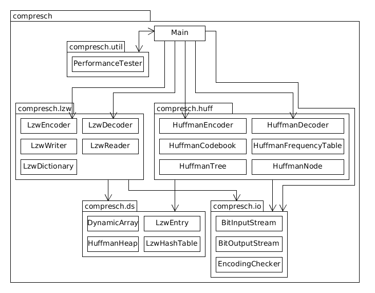

# Implementation

## Packaging and classes overview

## Main program
Main program can be used to encode and decode single files with Huffman coding or Lempel-Ziv-Welch compression. It is also possible to run performance tests on a folder of test files with both compression schemes.

##  Huffman Coding

Huffman encoding takes a byte sequence of symbols as input and produces a bit sequence as output. Intent is that encoded bit sequence is shorter than original byte sequence by using an optimal prefix coding for given input file.

**HuffmanEncoder** and **HuffmanDecoder** are the pair of classes that handle the logic behind compression and decompression of data and utilize all the secondary classes designed to help them.

**HuffmanTree** consists of **HuffmanNodes**. HuffmanTree is basically a prefix trie for given input file to be compressed. The path from root to a leaf, representing an encoded symbol, represents the bit sequence which is used as a codeword for a given symbol. For encoding the HuffmanTree is first built upon the frequency of given symbols. It is then converted to a canonical Huffman coding, which is built from lengths of codewords of ascending symbols.

**HuffmanCodebook** is responsible for holding all the information of built codes for encoding. After codebook has been built it can be used to query codewords for bytes in input stream. The codebook is built from *HuffmanTree*.

**HuffmanFrequencyTable** is a simple array of frequencies of input symbols which is used in generation of initial *HuffmanTree* consisting of optimal prefix codes for given symbols.

## Lempel-Ziv-Welch

Lempel-Ziv-Welch(from here on LZW) read variable length symbols from input producing fixed length symbols as output producing a dictionary of codewords during encoding/decoding. Intent is that encoded bit sequence is shorter than original bit sequence by utilizing codewords for bitsequences seen before.

**LzwEncoder** and **LzwDecoder** are the pair of classes that handle the logic behind compression and decompression of data and utilize the secondary classes designed to help them.

**LzwDictionary** is used for encoding/decoding of original/encoded bitstream. The dictionary is built while reading the input file until the maximum size of dictionary is reached. The size of dictionary is limited to 4096 codewords and 12-bit codewords are used for encoding/decoding.

**LzwWriter** utilizes BitOutputStream to write 12-bit codewords to output. 

**LzwReader** utilizes BitInputStream to read 12-bit codewords from input.

## I/O
**BitOutputStream** uses *java.io.ByteOutputStream* to write variable length bit sequences to output by using caching of bits to be written.

**BitInputStream** uses *java.io.ByteInputStream* to read variable length bit sequences from input by using caching of bits to be read.

## Data structures
**DynamicArray** is implemented using Java generics. It is an ordinary dynamically resized array for every kind of object type. It also implements Iterable<T> interface so it can be used via for-each statement.

**HuffmanHeap** is a minimum heap implementation which accepts only *HuffmanNode* as it's contents. HuffmanHeap is used in building of HuffmanTree.

**LzwHashTable** is a hashtable implementation consisting of multiple **LzwEntry**. It is the base for *LzwDictionary*.